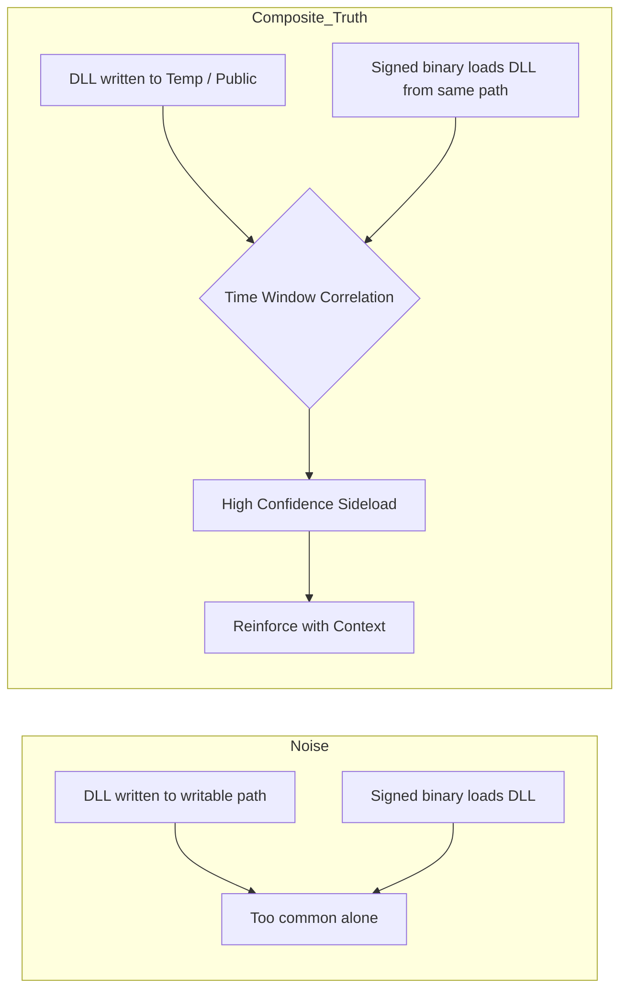
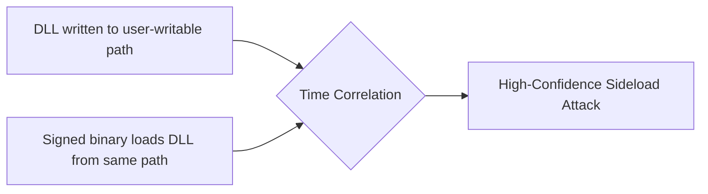

# ATTRIBUTION-NONCOMMERCIAL-SHAREALIKE 4.0 INTERNATIONAL (CC BY-NC-SA 4.0)

Copyright (c) 2026 Ala Dabat. All Rights Reserved.

This work (including all KQL queries, detection logic, documentation, and the "Minimum Truth" Framework architecture) is licensed under the Creative Commons Attribution-NonCommercial-ShareAlike 4.0 International License.

## You are free to:
* **Share** — copy and redistribute the material in any medium or format.
* **Adapt** — remix, transform, and build upon the material.

## Under the following terms:
* **Attribution** — You must give appropriate credit to **Ala Dabat**, provide a link to the license, and indicate if changes were made. You may do so in any reasonable manner, but not in any way that suggests the licensor endorses you or your use.
* **NonCommercial** — You may **NOT** use the material for commercial purposes (e.g., selling these rules, including them in a paid product, or putting them behind a paywall).
* **ShareAlike** — If you remix, transform, or build upon the material, you must distribute your contributions under the same license as the original.

---
**View the full Legal Code here:** https://creativecommons.org/licenses/by-nc-sa/4.0/legalcode


> [!NOTE]
> **Operational Calibration & Testing**
>
> These detection rules are architected for **logical correctness** and **high-fidelity signal extraction**. Validation was performed in an isolated **ADX-Docker** environment to ensure attack-truth and logic integrity.
>
> Please note:
> * **Baselines:** Final noise tuning and allow-listing require specific tenant telemetry and administrative context.
> * **Syntax:** Minor syntax variances (e.g., path escaping) may exist due to the difference between Docker-hosted Kusto and live Cloud schemas.

# Threat Hunting Philosophy & Detection Design

**Author:** Ala Dabat - This is a framework and a methadology I myself have created from hard earned trial and error. </br>
**Focus:** Practical, adversary-informed threat hunting for real SOC environments  
**Audience:** L2 / L2.5 Threat Hunters, Detection Engineers, Security Leads  


---

## Why This Repository Exists

Most SOCs struggle with threat hunting not because they lack tools, but because:

- Detections are **over-engineered**
- Behavioural chains are **forced where they are not required**
- Analysts are overwhelmed by **noise disguised as intelligence**
- Rules are written without regard for **SOC operating reality**

This repository documents a **deliberate, operationally grounded methodology** for threat hunting that:

- Scales to real SOC teams
- Preserves signal fidelity
- Reduces analyst fatigue
- Applies behavioural correlation **only when the attack requires it**

---

## Core Philosophy (TL;DR)

> **Start with the minimum truth required for the attack to exist.**  
> Everything else is reinforcement — not dependency.

If the baseline truth is not met, the attack **is not real**.

---

## Detection Maturity Model Used

### 1. Reductive Baseline (Truth First)

Every attack technique has a **minimum condition that must be true**.

If that condition is not met, the detection should not exist.

**Examples:**
- LSASS credential theft → *LSASS must be accessed*
- Kerberoasting → *Service tickets must be requested using weak encryption*
- OAuth abuse → *A cloud app must request high-risk scopes*

This prevents speculative or assumption-driven hunting.

---

### 2. Composite L2 / L2.5 Hunts (Default)

Most attacks do **not** require full behavioural chains.

Instead, this repository focuses on **Composite Hunts** that:
- Group **related high-signal indicators**
- Prefer **single telemetry sources** where possible
- Use minimal joins only when unavoidable

This is where **most effective threat hunting lives**.

---

### 3. Reinforcement (Confidence, Not Dependency)

Once baseline truth is met, confidence is increased using:
- parent / child execution context
- suspicious paths or arguments
- network proximity
- rarity / prevalence

Reinforcement:
- improves fidelity
- reduces noise
- **never defines the attack**

---

### 4. Behavioural Chains (Used Sparingly)

Behavioural correlation is used **only when the attack cannot exist without it**.

**Example:** DLL sideloading  
A DLL drop alone is benign.  
A DLL load alone is benign.  
The attack is only true when **both occur together**.

---

## Composite Threat Hunt Portfolio

This repository is organised around **Composite Hunts** covering the most critical attack surfaces across endpoint, identity, and cloud environments. (Always Changing and expanding)

### Implemented & Active Composite Rules

| Attack Surface | Composite Hunt | MITRE | Why It Matters |
|---------------|---------------|-------|----------------|
| **Credential Access** | **LSASS Access / Dump Attempts** | T1003.001 | Core SOC expectation; high signal, low noise |
| **Credential Access** | **NTDS.dit / AD Database Access** | T1003.003 | Domain compromise precursor |
| **Credential Access** | **Kerberoasting (Weak Encryption)** | T1558.003 | Detects RC4 / 0x17 downgrade abuse |
| **Persistence** | **WMI Event Subscription & Consumer** | T1546.003 | Fileless persistence via `scrcons.exe` |
| **Defense Evasion** | **LOLBin Proxy Execution** | T1218 | `rundll32`, `regsvr32`, `mshta` abuse |
| **Defense Evasion** | **DLL Sideloading (Minimal Chain)** | T1574.002 | Correlation only where structurally required |
| **Lateral Movement** | **SMB / Named Pipe Execution** | T1021.002 | PsExec-style behaviour |
| **Privilege Escalation** | **Account Manipulation (User / Group Changes)** | T1098 | Persistence, audit-critical |
| **Exfiltration Prep** | **Archive + Staging (Smash & Grab)** | T1560 | Data staging before exfiltration |
| **Cloud Identity** | **OAuth Illicit App Consent** | T1528 | Cloud persistence & data access |

---

### Planned Composite Additions (Roadmap)

These will follow the same reductive → composite → reinforcement model:

| Attack Surface | Planned Hunt | MITRE | Rationale |
|---------------|-------------|-------|-----------|
| Persistence | Service Creation / Modification Abuse | T1543.003 | High attacker ROI, low noise |
| Impact | Shadow Copy Deletion | T1490 | Ransomware precursor |
| Persistence | Scheduled Task Abuse (User Context) | T1053.005 | Common execution & persistence |
| Credential Access | SAM / Registry Hive Dump Attempts | T1003.002 | Complements LSASS coverage |
| Cloud Activity | OAuth Token Abuse / Graph API Misuse | T1528 | Post-consent cloud exploitation |

---

## Built-In Hunter Directives (Non-Negotiable)

Every composite hunt produces **guidance alongside results**, not after.

Each rule outputs a `HunterDirective` (or equivalent) that answers:

1. **Why** this fired (baseline truth)
2. **What** reinforces confidence
3. **What** to do next

**Example:**
> *HIGH: LSASS accessed by non-AV process using dump-related command line.  
> Action: Validate tool legitimacy, scope for lateral movement, escalate to L3.*

---

## Why Composite Hunts Matter (Example)

DLL sideloading is a technique that **cannot be confirmed from a single event**.



# Architectural Strategy: When to Split vs. Composite  
## Decision Framework: The **Minimum Truth** Doctrine

This repository follows a strict architectural rule for defining the boundaries of a **Composite Detection**:

- We **do not** group rules by *MITRE Tactic* (“all Persistence in one query”).
- We group rules by **Attack Surface Ecosystem** (the operational domain where the *same kind* of truth is observable).

A **Composite Rule** enforces context around a **single coherent stream of activity** (same mechanism, same telemetry surface, same “truth”).  
If the logic must jump across **different execution mediums**, **schemas**, or **transport mechanisms**, the rule is **split** into a sibling hunt.

> **Mental model:**  
> **The detection rule is the sensor.**  
> **The incident/case is the narrative that stitches sensors into an attack story.**

---

## 1) The Four Rules of Detection Architecture

###  Rule 1 — Split when the **Minimum Truth** changes
If the non-negotiable baseline event (“truth”) requires a fundamental **schema change**, **telemetry change**, or **mechanism change**, **SPLIT**.

**Examples of “Minimum Truth” shifts**
- Host process execution → identity log transaction  
- API call telemetry → artifact registry/file telemetry  
- SMB/Service lateral movement → WMI/DCOM lateral movement  
- DNS protocol telemetry → HTTP protocol telemetry  

---

###  Rule 2 — Split when the **noise domain** changes
If the rule would require a completely different allowlist/baseline strategy (e.g., SCCM vs developer automation vs DC replication), **SPLIT**.

---

###  Rule 3 — Split when the **telemetry surface** changes
Different primary tables/log sources = different sensors.

**Examples**
- `DeviceProcessEvents` ≠ `DeviceRegistryEvents` ≠ `SigninLogs` ≠ `DeviceNetworkEvents`

---

###  Rule 4 — Keep composite when you’re only refining **context**
Classification, scoring, enrichment, and “reinforcement” belong **inside** the rule *when the Minimum Truth stays the same*.

**Examples**
- Same process surface: different LOLBins doing the same intent
- Same network surface: different URIs/headers to the same destination category
- Same persistence surface: create vs change using the same tool and schema

---

## 2) Common Attack Ecosystems: Split vs. Keep Matrix (Comprehensive)

This matrix shows **real-world architectural decisions** across the **most common enterprise attack ecosystems**.

### Decision Matrix: Split vs. Keep

| Threat Ecosystem | Comparison Scenario | Decision | Architectural “Why” |
|---|---|---:|---|
| **Persistence: Scheduled Tasks** | `schtasks.exe /create` vs `Register-ScheduledTask` (PowerShell) | ✂️ SPLIT | Different truth surface: CLI process execution vs API/script abstraction. Different parsing + baselining. |
| **Persistence: Scheduled Tasks** | `schtasks.exe /create` vs `schtasks.exe /change` | ✅ KEEP | Same truth domain: same binary + schema. Intent differs but telemetry aligns. |
| **Persistence: Scheduled Tasks** | Task creation vs task execution telemetry | ✂️ SPLIT | “Creation” truth ≠ “Execution” truth. Separate
****

## Rarity & Organisational Prevalence (Used Correctly)

Rarity is **not** a detection trigger.  
It is a **prioritisation and confidence amplifier**.

In this methodology, **detection is driven by attack truth**, not by how uncommon an event is.  
Organisational prevalence is applied **only after** the baseline condition of an attack has been met.

> **If the minimum truth of the attack is not satisfied, rarity is irrelevant.**  
> **If the minimum truth *is* satisfied, rarity helps decide urgency and scope.**

### How Rarity Is Applied

Rarity is used in three safe, SOC-real ways:

### 1. Command / Behaviour Prevalence  
**Question:** *How many hosts in this organisation perform this exact behaviour?*

- Low prevalence (1–2 hosts) → likely targeted activity  
- High prevalence (many hosts) → possible tooling, deployment, or admin activity  

This is used to **prioritise triage**, not suppress alerts.

### 2. Parent / Actor Prevalence  
**Question:** *Who normally performs this action in this environment?*

- LOLBins launched by unusual parents (e.g. Office, WMI, script engines)  
- Privileged actions executed by unexpected users or service accounts  

This often surfaces **contextual malice** even when the binary itself is common.

### 3. Burst / Radius Prevalence  
**Question:** *How widely and how fast did this appear?*

- Single host → targeted intrusion  
- Multiple hosts in a short window → automation, lateral movement, or policy abuse  

This is especially effective for persistence, service creation, and credential access.

### What Rarity Is *Not* Used For

- Rarity is **never** a hard filter  
- Rarity does **not** determine whether an alert exists  
- Dangerous actions (e.g. LSASS access, illicit OAuth grants) are **always surfaced**, regardless of prevalence  

### Design Principle

> **Rarity decides how fast we respond — not whether we respond.**

This ensures:
- High-risk behaviour is never suppressed
- Analysts are not flooded with low-value noise
- Targeted attacks stand out without brittle logic

Rarity strengthens detection — it never replaces understanding.

---

## Organisational Prevalence (Used Correctly)

Organisational prevalence is one of the most misunderstood concepts in threat detection.

Many SOCs apply prevalence incorrectly as a blunt filter:

- “If it’s common, ignore it.”
- “If it’s rare, alert on it.”

This repository does **not** use prevalence that way.

---

### Core Principle

> **Prevalence is not a detection trigger.**  
> It is a *reinforcement and prioritisation amplifier* applied only after attack truth exists.

If the **Minimum Truth** is not satisfied, prevalence is irrelevant.

If the **Minimum Truth *is* satisfied**, prevalence helps determine urgency, scope, and analyst focus.

---

## Why Prevalence Exists in This Framework

Prevalence answers one operational question:

> **How normal is this behaviour in *this* organisation?**

Attack techniques do not exist in a vacuum.

The same command can be:

- benign in one environment  
- catastrophic in another  

Prevalence allows detection logic to remain behavioural, while still adapting to SOC reality.

---

## When Prevalence Should Be Applied

Prevalence is used only in three safe, SOC-real ways:

---

### 1. Behavioural Rarity (After Truth)

**Question:**  
How many endpoints exhibit this exact behaviour?

Example behaviours:

- PowerShell staging with suspicious parent  
- Registry persistence pointing to a user-writable path  
- Confirmed DLL sideload chain  

If only **1–2 devices** show this behaviour:

- likely targeted intrusion  
- deserves escalation  

If **200 devices** show it:

- may be tooling, deployment, or admin automation  

Prevalence helps prioritise — not suppress.

---

### 2. Actor / Parent Context Prevalence

**Question:**  
Who normally performs this action here?

Example:

- `rundll32.exe` launched by `winword.exe`
- Scheduled task created by a normal user account
- LSASS access by a non-security process

The binary may be common.

The **actor and execution context** may not be.

This is where prevalence becomes true reinforcement.

---

### 3. Burst / Radius Prevalence

**Question:**  
How fast and how widely did this appear?

- Single host → targeted persistence  
- Multiple hosts in minutes → lateral movement or automation  
- Domain-wide spread → ransomware precursor  

Prevalence here becomes an incident-shaping signal.

---

## What Prevalence Is *Not* Used For

This methodology explicitly avoids dangerous prevalence misuse:

- ❌ Rarity is never a standalone alert condition  
- ❌ Common ≠ safe  
- ❌ Rare ≠ malicious  
- ❌ High-risk truths are never suppressed  

Example:

- LSASS access is always surfaced  
- OAuth illicit consent is always surfaced  
- Silent scheduled task persistence is always surfaced  

Regardless of prevalence.

---

## Simple Example (Clear as Day)

### Scenario: Scheduled Task Persistence

**Minimum Truth (Attack Exists):**

A task is registered that launches PowerShell from a suspicious location:

```kql
RegistryValueData has "powershell"
and RegistryValueData has "\\users\\public\\"
---
```
## Organisational Prevalence (Used Correctly)

Organisational prevalence is one of the most misunderstood concepts in threat detection.

Many SOCs apply prevalence incorrectly as a blunt filter:

- “If it’s common, ignore it.”
- “If it’s rare, alert on it.”

This repository does **not** use prevalence that way.

---

### Core Principle

> **Prevalence is not a detection trigger.**  
> It is a *reinforcement and prioritisation amplifier* applied only after attack truth exists.

If the **Minimum Truth** is not satisfied, prevalence is irrelevant.

If the **Minimum Truth *is* satisfied**, prevalence helps determine urgency, scope, and analyst focus.

---

## Why Prevalence Exists in This Framework

Prevalence answers one operational question:

> **How normal is this behaviour in *this* organisation?**

Attack techniques do not exist in a vacuum.

The same command can be:

- benign in one environment  
- catastrophic in another  

Prevalence allows detection logic to remain behavioural, while still adapting to SOC reality.

---

## When Prevalence Should Be Applied

Prevalence is used only in three safe, SOC-real ways:

---

### 1. Behavioural Rarity (After Truth)

**Question:**  
How many endpoints exhibit this exact behaviour?

Example behaviours:

- PowerShell staging with suspicious parent  
- Registry persistence pointing to a user-writable path  
- Confirmed DLL sideload chain  

If only **1–2 devices** show this behaviour:

- likely targeted intrusion  
- deserves escalation  

If **200 devices** show it:

- may be tooling, deployment, or admin automation  

Prevalence helps prioritise — not suppress.

---

### 2. Actor / Parent Context Prevalence

**Question:**  
Who normally performs this action here?

Example:

- `rundll32.exe` launched by `winword.exe`
- Scheduled task created by a normal user account
- LSASS access by a non-security process

The binary may be common.

The **actor and execution context** may not be.

This is where prevalence becomes true reinforcement.

---

### 3. Burst / Radius Prevalence

**Question:**  
How fast and how widely did this appear?

- Single host → targeted persistence  
- Multiple hosts in minutes → lateral movement or automation  
- Domain-wide spread → ransomware precursor  

Prevalence here becomes an incident-shaping signal.

---

## What Prevalence Is *Not* Used For

This methodology explicitly avoids dangerous prevalence misuse:

- ❌ Rarity is never a standalone alert condition  
- ❌ Common ≠ safe  
- ❌ Rare ≠ malicious  
- ❌ High-risk truths are never suppressed  

Example:

- LSASS access is always surfaced  
- OAuth illicit consent is always surfaced  
- Silent scheduled task persistence is always surfaced  

Regardless of prevalence.

---

## Simple Example (Clear as Day)

### Scenario: Scheduled Task Persistence

**Minimum Truth (Attack Exists):**

A task is registered that launches PowerShell from a suspicious location:

```kql
RegistryValueData has "powershell"
and RegistryValueData has "\\users\\public\\"
```

- That is already persistence.
- Now prevalence is applied after this truth.


## Organisational Prevalence Reinforcement

```kql
| summarize DeviceCount = dcount(DeviceId) by TaskFingerprint
| extend IsRare = DeviceCount <= 2
```

Interpretation:

a) If this persistence appears on 1 device → likely intrusion
b) If it appears on 300 devices → likely software deployment or misconfigured IT script
c) The detection does not disappear.
d) The response priority changes.
e) Detection Engineering Rule

**Prevalence decides how fast we respond — not whether we respond.**

This ensures:

1) High-risk attack truths are never hidden
2) Analysts are not flooded with background noise
3) Targeted tradecraft stands out naturally

**Composite hunts remain operationally grounded**

- Prevalence strengthens detection.
- It never replaces understanding.

# Summary

Minimum Truth defines the attack.
Reinforcement increases confidence.
Prevalence scales triage.

---

## Correlation vs. Ghost Chains (When Joins Become Fragile)

Correlation is one of the most powerful tools in behavioural detection.

It is also one of the easiest ways to destroy signal quality.

Most SOCs do not fail because they lack correlation.

They fail because they correlate *everything*.

This framework treats correlation as a scalpel, not a net.

---

## Core Principle

> **Correlation is only valid when the attack cannot exist without multiple linked events.**

If the technique is already true from one event stream,  
forcing joins creates noise, brittleness, and false narratives.

---

## What Is a “Ghost Chain”?

A **Ghost Chain** is when a detection query stitches together unrelated activity
into a fake kill-chain story.

This happens when:

- events are common background noise  
- time windows are arbitrary  
- joins are used to “make it look advanced”  
- the attacker does not actually need all stages  

The result is:

- high severity alerts  
- low analyst trust  
- broken triage  
- missed real attacks hiding nearby  

---

## Why Ghost Chains Are Dangerous

Correlation introduces **dependency**:

- If one telemetry source is missing → detection fails  
- If events happen outside the window → detection fails  
- If normal activity overlaps → false chain forms  

This is why monolithic “kill-chain mega rules” collapse in production.

---

## The Framework Rule

> **The Detection Rule is the sensor.  
> The Incident is the narrative.**

We do not force one query to tell the whole story.

We deploy clean sensors, then correlate at the case/incident level.

---

## When Correlation IS Required (True Composite Truth)

Correlation is mandatory when:

> No single event proves the technique.

### Example: DLL Sideloading

A DLL drop alone is benign.  
A DLL load alone is benign.  

The attack is only true when both occur together.



## When Correlation Is NOT Required (Ghost Risk)

**Example: Registry Persistence**

If a registry Run key is set to:

```
powershell.exe -enc <payload>
```


That is already persistence.

You do not need to join it with:
- network events
- unrelated PowerShell execution
- scheduled task execution
- lateral movement

**Those may happen later, but they are not required for truth.**

Forcing them creates ghost chains.

Simple Example (Clear as Day)
❌ Bad Correlation (Ghost Chain)
// Registry persistence
RegistryValueSet
| join NetworkConnection
| join ProcessInjection
| where all within 10 minutes


Why this fails:

- persistence may be set today
- execution may happen tomorrow
- network traffic may be unrelated
- injection may never occur

This produces fake kill-chain certainty.

✅ Correct Architecture (Truth First)

## Composite Rule 1: Persistence Sensor
```kql
DeviceRegistryEvents
| where RegistryKey has "\\Run"
| where RegistryValueData has "powershell"
```


Truth: persistence exists.

Composite Rule 2: Runtime Loader Sensor

```kql
DeviceEvents
| where ActionType == "PowerShellScriptBlock"
| where AdditionalFields has "VirtualAlloc"
```
Truth: in-memory execution intent exists.


##Composite Rule 3: Silent Task Sensor

```kql
DeviceRegistryEvents
| where RegistryKey has "\\Schedule\\TaskCache"
| where RegistryValueData has "-enc"#
```

Truth: task persistence exists.

Incident-Level Correlation (Narrative Layer)

Now Sentinel/MDE correlates:
a) same device
b) same user
c) same timeframe
d) multiple truths firing

This builds the attack story correctly.

## Operational Rule of Thumb

Correlate inside a rule only when:

-the technique cannot exist without both events
- the telemetry sources are stable
- the join reduces ambiguity, not increases complexity

Split into sibling composites when:

1) the truth surface changes
2) the noise domain changes
3) the attacker method is optional
4) the timing may vary

# Summary

Correlation is not sophistication.
Correlation is dependency.

Use it only when:

- The attack truth structurally requires convergence.

Otherwise:

- detect the truth
- reinforce confidence
- correlate at the incident layer
- This prevents ghost chains and keeps hunts operational.
